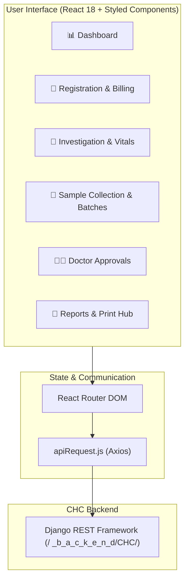

# Corporate Health Checkup (CHC) - Frontend Application

A modern, responsive Single Page Application (SPA) built with **React 18** and **Styled Components** for managing end-to-end Corporate Health Checkups, clinical investigations, employee registrations, billing, sample accessioning, batch management, doctor approvals, and comprehensive multi-parameter diagnostic reports.

---

## 🚀 Overview & Architecture

The **CHC Frontend** is part of the Corporate Health Checkup suite. It interfaces with the Django REST Framework backend via a centralized, JWT-authenticated API request layer and communicates with hybrid storage (PostgreSQL + MongoDB / GridFS).



---

## 📦 Tech Stack

- **Core**: React 18, React DOM, React Scripts, Craco
- **Styling**: Styled Components, Lucide React (Icons)
- **State & Form Controls**: React-Datepicker, Axios
- **Data Visualization**: Recharts, Chart.js
- **Export & Print**: Custom CSS `@page` print engines, HTML iframe isolation, CSV exports

---

## 📂 Project Structure

```
CHC_frontend/
├── public/
│   ├── index.html              # HTML shell
│   └── favicon.ico
├── src/
│   ├── App.js                  # Main Application Component & Navigation Routing
│   ├── index.js                # React Root & Global Providers
│   ├── index.css               # Global Reset & Typography
│   └── Components/
│       ├── apiRequest.js                   # Central Axios client with token/header handling
│       ├── GlobalStyles.js                 # Shared UI tokens, themes, buttons & cards
│       ├── Sidebar.js                      # Navigation sidebar
│       ├── Login.js                        # Authentication & Role routing
│       ├── Dashboard.js                    # Analytics, checkup metrics & charts
│       ├── EmployeeRegistration.js         # Employee onboarding & bulk upload
│       ├── RegisteredEmployees.js          # Employee directory & profile viewing
│       ├── RegistrationEdition.js          # Edit employee registration data
│       ├── PackageCreation.js              # Health package & dynamic test definition
│       ├── Investigation.js                # Clinical tests, vitals, dynamic field entry & file upload
│       ├── InvestigationChecklist.js       # Real-time investigation progress tracking
│       ├── DoctorApprovalInvestigations.js # Pathologist / Doctor review & approval
│       ├── DoctorApprovalOphthalmology.js  # Eye clinic review & approval
│       ├── OverAllApproveReport.js         # Final comprehensive checkup sign-off
│       ├── CHCReport.js                    # Patient report compilation & PDF viewer
│       ├── SampleCollection.js             # Barcode scanning & sample collection
│       ├── SampleTransfer.js               # Sample dispatch & handover
│       ├── BatchGeneration.js              # Specimen grouping into batches
│       ├── GeneratedBatch.js               # Batch tracking & dispatch history
│       ├── CreditToPaid.js                 # Credit settlement & payment reconciliation
│       ├── PaymentReport.js                # Financial billing summaries
│       ├── OffsitePatients.js              # Camp / off-site checkup management
│       └── Images/                         # Report headers, footers & branding assets
├── .env                        # Environment configuration
├── craco.config.js             # Webpack customization
└── package.json                # Dependencies and scripts
```

---

## ⚙️ Environment Configuration

Create or configure the [`.env`](file:///d:/SMRFT/Projects/CHC/CHC_frontend/.env) file in the root of `CHC_frontend`:

```env
REACT_APP_BACKEND_LAB_BASE_URL=https://shinova.in/_b_a_c_k_e_n_d/CHC/
```

> [!IMPORTANT]
> Always end the base URL with a trailing slash (`/`). The `apiRequest.js` utility appends relative endpoints directly.

---

## 🛠 Setup & Development

### 1. Install Dependencies
```bash
npm install
```

### 2. Run Development Server
```bash
npm start
```
The application will launch on `http://localhost:3000`.

### 3. Production Build
```bash
npm run build
```
Creates an optimized production bundle in the `build/` folder.

---

## 🔑 Key Modules & Features

1. **Investigation Management (`Investigation.js`)**:
   - Vitals recording (Height, Weight, BMI calculation, BP, SpO2).
   - Dynamic parameter groups (e.g. Whole Body, Trunk, Arm, Leg composition, Doctor Comments).
   - Multi-file attachments (ECHO, ECG, PFT, Ultrasound, X-Ray) uploaded via GridFS.
   - Ophthalmology acuity records (Near/Distance vision, Color vision, Ocular movement).

2. **Accessioning & Sample Tracking (`SampleCollection.js`, `BatchGeneration.js`)**:
   - Barcode-driven sample verification and status updating.
   - Multi-specimen batch grouping and physical courier dispatch logging.

3. **Report Generation & Isolated Print Engines (`CHCReport.js`)**:
   - High-fidelity clinical report templates with fixed header/footer branding.
   - Isolated hidden iframe printing (`@page { size: portrait; margin: 10mm; }`).

---

## 🛡️ Coding Standards

- Use the central [`apiRequest.js`](file:///d:/SMRFT/Projects/CHC/CHC_frontend/src/Components/apiRequest.js) wrapper for all API calls.
- Never hardcode company identifiers (e.g. `"CHC002"`). Always resolve company and employee IDs dynamically.
- When creating `FormData`, guard against appending `undefined` or `null` which strings as `"undefined"`.
